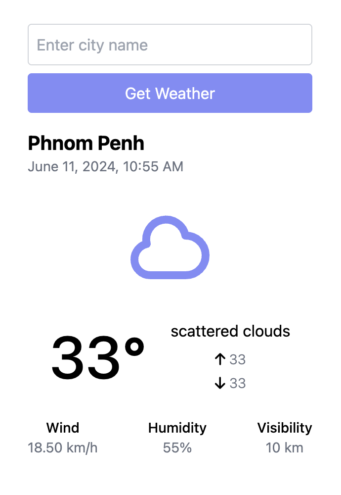

### Go HTMX Websockets Weather API

### Weather App Description

The Weather App is a real-time weather monitoring application designed to provide up-to-date weather information for any city specified by the user. Leveraging WebSockets and HTMX for dynamic updates, the app allows users to input a city name, triggering the backend to fetch and display current weather data such as temperature, humidity, wind speed, and visibility. Users can easily switch between cities by submitting a new city name in the input field, and the application automatically updates to reflect the latest weather conditions for the selected location.

### Key Features:

- **Real-Time Weather Updates**: Provides continuous weather information without the need for manual refreshes.
- **Dynamic City Selection**: Users can enter any city name to get current weather data for that location.
- **Responsive Design**: The app is designed with a clean, responsive interface, ensuring accessibility and usability across various devices.

